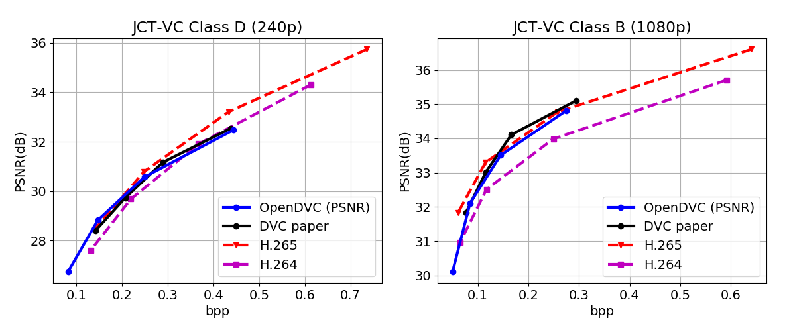

Our latest works on learned video compression:

- Hierarchical Learned Video Compression (HLVC) (**CVPR 2020**) [[Paper](https://arxiv.org/abs/2003.01966)] [[Project page](https://github.com/RenYang-home/HLVC)]

- Recurrent Learned Video Compression (RLVC) [[Paper](https://arxiv.org/abs/2006.13560)]

# OpenDVC -- An open source implementation of the DVC Video Compression Method

An open source Tensorflow implementation of the paper:

> Lu, Guo, *et al.* "DVC: An end-to-end deep video compression framework." *Proceedings of the IEEE Conference on Computer Vision and Pattern Recognition (CVPR)*. 2019.

The original DVC method is only optimized for PSNR. In our OpenDVC codes, we provide the **PSNR-optimized** re-implementation, denoted as OpenDVC (PSNR), and also the **MS-SSIM-optimized** model, denoted as OpenDVC (MS-SSIM).

If our open source codes are helpful for your research, please cite the technical report:
```
@article{yang2020recurrent,
  title={Open{DVC}: An Open Source Implementation of the {DVC} Video Compression Method},
  author={Yang, Ren and Van Gool, Luc and Timofte, Radu},
  journal={arXiv preprint arXiv:2006.15862},
  year={2020}
}
```

Contact:

Ren Yang @ ETH Zurich, Switzerland

Email: ren.yang@vision.ee.ethz.ch

## Dependency

- Tensorflow 1.12

- Tensorflow-compression 1.0 ([Download link](https://github.com/tensorflow/compression/releases/tag/v1.0))

  (*After downloading, put the folder "tensorflow_compression" to the same directory as the codes.*)

- Pre-trained models ([Download link](https://drive.google.com/drive/folders/1gUkf9FNjiZw6Pcr5U_bl3jgbM1_ZpB2K?usp=sharing))

  (*Download the folders, e.g., "PSNR_1024_model", to the same directory as the codes.*)

- BPG ([Download link](https://bellard.org/bpg/))  -- needed only for the PSNR model

  (*In our PSNR model, we use BPG to compress I-frames instead of training learned image compression models.*)

- Context-adaptive image compression model, Lee et al., ICLR 2019 ([Paper](https://arxiv.org/abs/1809.10452), [Model](https://github.com/JooyoungLeeETRI/CA_Entropy_Model)) -- needed only for the MS-SSIM model

  (*In our MS-SSIM model, we use Lee et al., ICLR 2019 to compress I-frames.*)

## How to use

### Preperation

We follow Lu *et al.*, DVC to feed RGB images into the deep encoder. To compress a YUV video, please first convert to PNG images with the following command.

```
ffmpeg -pix_fmt yuv420p -s WidthxHeight -i Name.yuv -vframes Frame path_to_PNG/f%03d.png
```

Note that, OpenDVC currently only supports the frames with the height and width as the multiples of 16. The original DVC method requires the multiples of 32. Therefore, when using OpenDVC, please first crop frames, e.g.,

```
ffmpeg -pix_fmt yuv420p -s 1920x1080 -i Name.yuv -vframes Frame -filter:v "crop=1920:1072:0:0" path_to_PNG/f%03d.png
```

### Encoder for video

The augments in OpenDVC encoder (OpenDVC_test_video.py) include:

```
--path, the path to PNG files;

--frame, the total frame number to compress;

--GOP, the GOP size, e.g., 10;

--mode, compress with the PSNR or MS-SSIM optimized model;

--metric, evaluate quality in terms of PSNR or MS-SSIM;

--python_path, the path to python (only used for MS-SSIM model to run Lee et al., ICLR 2019 on I-frames);

--CA_model_path, the path to CA_EntropyModel_Test of Lee et al., ICLR 2019 (only used for MS-SSIM model);

--l, lambda value. The pre-trained PSNR models are trained by 4 lambda values, i.e., 256, 512, 1024 and 2048, with increasing bit-rate/PSNR. The MS-SSIM models are trained with lambda values of 8, 16, 32 and 64, with increasing bit-rate/MS-SSIM;

--N, filter number in CNN (Do not change);

--M, channel number of latent representations (Do not change).
```

For example, the test code for OpenDVC encoder can be used as follows.
```
python OpenDVC_test_video.py --path BasketballPass --model PSNR  --metric PSNR --l 1024
```
```
python OpenDVC_test_video.py --path BasketballPass --model MS-SSIM  --metric MS-SSIM --python python --CA_model_path ./CA_EntropyModel_Test --l 32
```
The OpenDVC encoder generates the encoded bit-stream and compressed frames in two folders.
```
path = args.path + '/' # path to PNG
path_com = args.path + '_com_' + args.mode  + '_' + str(args.l) + '/' # path to compressed frames
path_bin = args.path + '_bin_' + args.mode  + '_' + str(args.l) + '/' # path to encoded bit-streams
```

### Decoder for video

The corresponding video decoder is OpenDVC_test_video_decoder.py, with the following arguments:
```
--path_bin, the path to bitstreams;

--path_com, the path to save the decoded frames;

--frame, the total frame number to decode;

--GOP, the GOP size, e.g., 10;

--Height, the height of frames;

--Width, the width of frames; 

  (In practical scenerio, the GOP size and resolution information can be writted in the filehead during encoding)

--mode, compress with the PSNR or MS-SSIM optimized model;

--python_path, the path to python (only used for MS-SSIM model to run Lee et al., ICLR 2019 on I-frames);

--CA_model_path, the path to CA_EntropyModel_Test of Lee et al., ICLR 2019 (only used for MS-SSIM model);

--l, lambda value;

--N, filter number in CNN (Do not change);

--M, channel number of latent representations (Do not change).
```

For example, the decoder can be used as:
```
python OpenDVC_test_video_decoder.py --path_bin BasketballPass_bin_PSNR_1024 --path_com BasketballPass_dec_PSNR_1024 --model PSNR --l 1024 --Height 240 --Width 416 --GOP 10 --frame 100
```

### Encoder for one frame

We also provide the encoder for compressing one frame (OpenDVC_test_P-frame.py), which can be used more flexibly. The arguments are as follows:
```
--ref, the path to the reference frame, e.g., ./ref.png. In (Open)DVC, it should be the previous compressed frame;

--raw, the path to the current raw frame which is to be compressed, e.g., ./raw.png;

--com, the path to save the compressed frame;

--bin, the path to save the bitstream;

--mode, compress with the PSNR or MS-SSIM optimized model;

--metric, evaluate quality in terms of PSNR or MS-SSIM;

--l, lambda value;

--N, filter number in CNN (Do not change);

--M, channel number of latent representations (Do not change).
```

For example:

```
python OpenDVC_test_P-frame.py --ref BasketballPass_com/f001.png --raw BasketballPass/f002.png --com BasketballPass_com/f002.png --bin BasketballPass_bin/002.bin --model PSNR  --metric PSNR --l 1024
```

### Decoder for one frame

The corresponding decoder for one frame is OpenDVC_test_P-frame_decoder.py, whose auguments are the same the encoder, excluding "--raw" and "--metric".

For example:

```
python OpenDVC_test_P-frame_decoder.py --ref BasketballPass_com/f001.png --bin BasketballPass_bin/002.bin --com BasketballPass_com/f002.png  --model PSNR --l 1024
```


## Performance

As shown in the figures below, our **OpenDVC (PSNR)** model achieves comparable PSNR performance with the reported results in Lu *et al.*, DVC (PSNR optimized), and our **OpenDVC (MS-SSIM)** model obviously outperforms DVC in terms of MS-SSIM.


